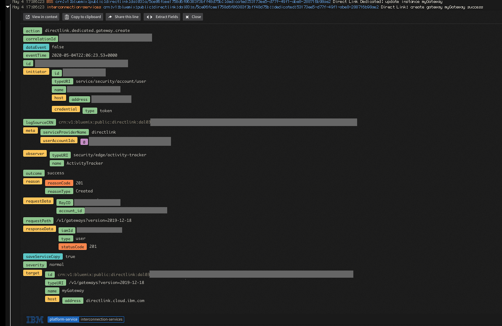
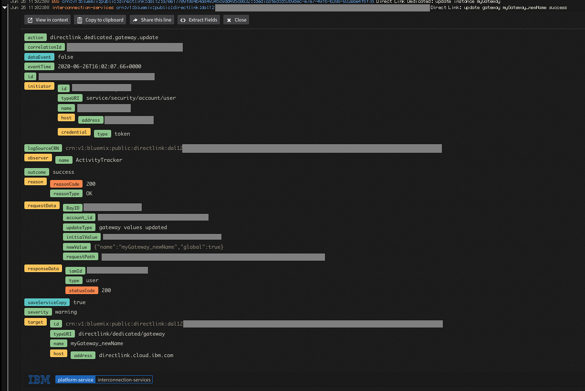

---

copyright:
  years: 2020
lastupdated: "2020-05-18"

keywords: IBM, activity tracker, LogDNA, event, security, {{site.data.keyword.dl_short}}

subcollection: dl

---

{:external: target="_blank" .external}
{:shortdesc: .shortdesc}
{:table: .aria-labeledby="caption"}
{:codeblock: .codeblock}
{:tip: .tip}
{:important: .important}
{:note: .note}

# Auditing events for {{site.data.keyword.dl_full_notm}}
{: #at_events}

As a security officer, auditor, or manager, you can use the Activity Tracker service to track how users and applications interact with the {{site.data.keyword.dl_short}} service in {{site.data.keyword.cloud}}.
{: shortdesc}

{{site.data.keyword.at_full_notm}} records user-initiated activities that change the state of a service in {{site.data.keyword.cloud_notm}}. You can use this service to investigate abnormal activity and critical actions and to comply with regulatory audit requirements. In addition, you can be alerted about actions as they happen. The events that are collected comply with the Cloud Auditing Data Federation (CADF) standard. For more information, see the [getting started tutorial for {{site.data.keyword.at_full_notm}}](/docs/Activity-Tracker-with-LogDNA?topic=Activity-Tracker-with-LogDNA-getting-started).

## Events for {{site.data.keyword.dl_short}} Dedicated
{: #at_actions_dedicated}

### List of management events
{: #at_management_events_dedicated}

| Action                      | Description |
|-----------------------------|---------|
| `directlink.dedicated.gateway.create` | Dedicated gateway was created. |
| `directlink.dedicated.gateway.delete` | Dedicated gateway was deleted. |
| `directlink.dedicated.gateway.update` | Dedicated gateway was updated. |
| `directlink.dedicated.virtual-connection.create` | Dedicated virtual connection was created. |
| `directlink.dedicated.virtual-connection.delete` | Dedicated virtual connection was deleted. |
| `directlink.dedicated.virtual-connection.update` | Dedicated virtual connection was updated. |
| `directlink.dedicated.completion-notice.create` | Dedicated completion notice was created. |
{: caption="Table 1. List of {{site.data.keyword.dl_short}} Dedicated management events" caption-side="top"}

### List of data events
{: #at_data_events_dedicated}

| Action                      | Description |
|-----------------------------|---------|
| `directlink.dedicated.gateway.read` | Dedicated gateway was retrieved. |
| `directlink.gateway.list` | Dedicated and Connect gateways were listed. |
| `directlink.dedicated.virtual-connection.read` | Dedicated virtual connection was retrieved. |
| `directlink.dedicated.completion-notice.read` | Dedicated completion notice was retrieved. |
{: caption="Table 2. List of {{site.data.keyword.dl_short}} Dedicated data events" caption-side="top"}

## Events for {{site.data.keyword.dl_short}} Connect
{: #at_actions_connect}

### List of management events
{: #at_management_events_connect}

| Action                      | Description |
|-----------------------------|---------|
| `directlink.connect.gateway.create` | Connect gateway was retrieved. |
| `directlink.connect.gateway.delete` | Connect gateway was deleted. |
| `directlink.connect.gateway.update` | Connect gateway was updated. |
| `directlink.connect.virtual-connection.create` | Connect virtual connection was created. |
| `directlink.connect.virtual-connection.delete` | Connect virtual connection was deleted. |
| `directlink.connect.virtual-connection.update` | Connect virtual connection was updated. |
| `directlink.connect.gateway.action` | Connect gateway action was applied. |
{: caption="Table 3. List of {{site.data.keyword.dl_short}} Connect management events" caption-side="top"}

### List of data events
{: #at_data_events_connect}

| Action                      | Description |
|-----------------------------|---------|
| `directlink.connect.gateway.read` | Connect gateway was retrieved. |
| `directlink.gateway.list`  | Dedicated and Connect gateways were listed. |
| `directlink.connect.virtual-connection.list` | Connect virtual connections were listed. |
| `directlink.connect.virtual-connection.read` | Connect virtual connection was retrieved. |
{: caption="Table 4. List of {{site.data.keyword.dl_short}} Connect data events" caption-side="top"}

## Viewing events
{: #at_ui}

Events are available in the **Frankfurt (eu-de)** region.

To view these events, you must [provision an instance](/docs/services/Activity-Tracker-with-LogDNA?topic=Activity-Tracker-with-LogDNA-provision#provision) of the {{site.data.keyword.at_full_notm}} service in the **Frankfurt (eu-de)** region. Then, you must [open the {{site.data.keyword.at_full_notm}} UI](/docs/services/Activity-Tracker-with-LogDNA?topic=Activity-Tracker-with-LogDNA-launch#launch_step2).

## Analyzing events
{: #at_events_iam_analyze}

{{site.data.keyword.at_full_notm}} compiles all of your logs at an account level, which means that all of your services are shown in the same instance, per region. If you have an app that runs in Dallas and another app that runs in London, the events are found in the respective instances of Activity Tracker.

**Prerequisite**: You must have an instance of {{site.data.keyword.at_full_notm}} in the region where you want to track events.

1. Log in to your IBM Cloud account.
1. In the IBM Cloud console navigation, click **Observability**.
1. Select **Activity Tracker** from the **Observability** navigation.
1. Click **View LogDNA**. When the dashboard loads, you'll see an overview of all of the activity that is covered by that instance of Activity Tracker with LogDNA. You can use the search operators to filter the events by tags, sources, apps, or levels. You can also search for specific events or jump to a specific timeframe.
1. To see events for a specific application, select the app that you want to track from the **All Apps** list. To help meet compliance regulations, you can choose to retain your events or archive them into [IBM Cloud Object Storage](https://www.ibm.com/cloud/object-storage).

Figure 1 shows an Activity Tracker instance with a sample Create Gateway event.

   {: caption="Figure 1: Create Gateway event" caption-side="bottom"}

Figure 2 shows an Activity Tracker instance with a sample Update Gateway event.  `newValue` shows the new values and `initialValue` lists the ID of the resource being changed.

   {: caption="Figure 2: Update Gateway event" caption-side="bottom"}
