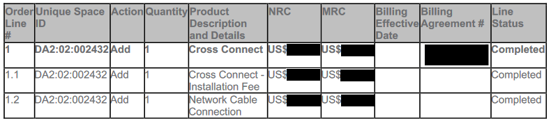
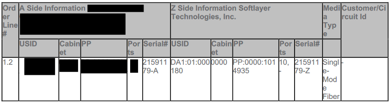
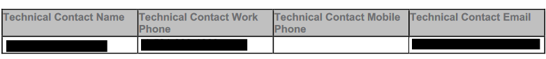

---

copyright:
  years: 2021, 2024
lastupdated: "2024-07-15"

keywords:

subcollection: dl

---

{{site.data.keyword.attribute-definition-list}}

# Completion notice example
{: #completion-notice-example}

Here is an example completion notice from a {{site.data.keyword.dl_short}} provider.
{: shortdesc}

---

Do not reply directly to this email. This was sent from a notification-only address that cannot accept incoming email.

We are pleased to inform you that your order (#xxxxx) was completed by the IBX team.

ORDER DETAILS

xxxxxxxxxxxxxxx

IBX: DA2

{: caption="Order details" caption-side="bottom"}

PRODUCT DETAILS

Details show the Serial# and the Z-side demarcs, proving that the cross-connects were installed into the correct patch panel/ports.

{: caption="Product details" caption-side="bottom"}

TECHNICAL CONTACT

{: caption="Technical contact" caption-side="bottom"}
