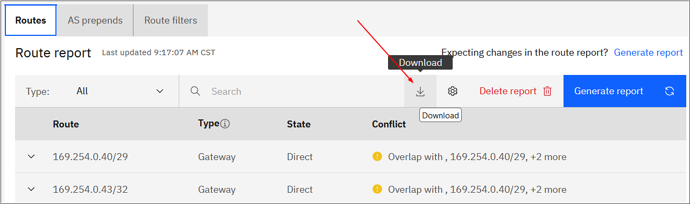

---

copyright:
  years: 2024
lastupdated: "2024-11-15"

keywords: Direct Link

subcollection: dl

---

{{site.data.keyword.attribute-definition-list}}

# Understanding data portability for Direct Link
{: #data-portability}

[Data portability](#x2113280){: term} involves a set of tools and procedures that enable customers to export the digital artifacts that are needed to implement similar workload and data processing on different service providers or on-premises software. It includes procedures for copying and storing the service customer content, including the related configuration that is used by the service to store and process the data, on the customer's own location.
{: shortdesc}

## Responsibilities
{: #data-portability-responsibilities}

{{site.data.keyword.cloud_notm}} services provide interfaces and instructions to guide the customer to copy and store the service customer content, including the related configuration, on their own selected location.

The customer is responsible for the use of the exported data and configuration for data portability to other infrastructures, which includes:

- The planning and execution for setting up alternative infrastructure on different cloud providers or on-premises software that provide similar capabilities to the {{site.data.keyword.IBM_notm}} services.
- The planning and execution for the porting of the required application code on the alternative infrastructure, including the adaptation of customer's application code, deployment automation, and so on.
- The conversion of the exported data and configuration to the format that's required by the alternative infrastructure and adapted applications.

To find out more about responsibility ownership for using {{site.data.keyword.cloud}} products between {{site.data.keyword.IBM_notm}} and customer see [Understanding your responsibilities when using Direct Link](/docs/dl?topic=dl-dl-responsibilities).

## Data export procedures
{: #data-portability-procedures}

Customer content is not stored. Only the metadata regarding the configuration of the transit gateways ordered by the customer is retained, exactly as specified by the customer. There is no need for the customer to export this metadata.
{: important}

### Exporting route report data from the UI
{: #export-route-report-data}

You can [generate a report](/docs/dl?topic=dl-generate-route-reports&interface=ui) that lists all the routes known to a direct link and its associated connections. If using the cross-account VPC linking feature, you can also see which prefixes or subnets are being routed through your cross-connect router.

When creating a route report from the details page of a direct link, you can download the data using the Download icon.

{: caption="Downloading route report data using the UI" caption-side="bottom"}

### Exporting Direct Link data with the CLI and API
{: #direct-link-export-cli-api}

The following table provides mechanisms to export the settings and configurations that are used to process the customer's content through the means of the IBM Cloud Direct Link [CLI](/docs/dl?topic=dl-dl-cli) and [API](/apidocs/direct_link). The procedures given in the linked documentation should be followed and the output stored to ensure all necessary configuration data is available.

| CLI  | API |
|--------------------|-------------------------|
| [ibmcloud dl asprepends](/docs/dl?topic=dl-dl-cli#list-all-asprepends) \n [ibmcloud dl export-route-filters](/docs/dl?topic=dl-dl-cli#export-route-filters) \n [ibmcloud dl gateways](/docs/dl?topic=dl-dl-cli#list-all-gateways) \n [ibmcloud dl import-route-filters](/docs/dl?topic=dl-dl-cli#import-route-filters) \n [ibmcloud dl locations](/docs/dl?topic=dl-dl-cli#list-locations-offering-type-json) \n [ibmcloud dl offering-speeds](/docs/dl?topic=dl-dl-cli#offering-speeds-list) \n [ibmcloud dl ports](/docs/dl?topic=dl-dl-cli#list-all-ports) \n [ibmcloud dl route-reports](/docs/dl?topic=dl-dl-cli#route-report-list-view) \n [ibmcloud dl virtual-connections](/docs/dl?topic=dl-dl-cli#virtual-connections-list) | [list as prepends](/apidocs/direct_link#listgatewayasprepends) \n [list export route filters](/apidocs/direct_link#list-gateway-export-route-filters) \n [list gateways](/apidocs/direct_link#listgateways) \n [list import route filters](/apidocs/direct_link#list-gateway-import-route-filters) \n [list locations](/apidocs/direct_link#listofferingtypelocations) \n [list speeds](/apidocs/direct_link#listofferingtypespeeds) \n [list ports][(/apidocs/direct_link#listports) \n [list route reports](/apidocs/direct_link#list-gateway-route-reports) \n [list virtual connections](/apidocs/direct_link#listgatewayvirtualconnections) \n [list cross connect routers](/apidocs/direct_link#listofferingtypelocationcrossconnectrouters) |
{: caption="Exporting Direct Link data with the CLI and API" caption-side="bottom"}

## Exported data formats
{: #data-portability-data-formats}

Direct Link supports the following data format and schema of the exported data, configuration, and application:

* Export in JSON format only

Example command using the CLI, [ibmcloud dl gateways](/docs/dl?topic=dl-dl-cli#list-all-gateways):

```sh
ibmcloud dl gateways|gws [--help|-h] [--output format]
```
{: pre}

Example request using the API, [directlink.gateway.list](/apidocs/direct_link#listgateways):

```sh
curl -X GET https://$DL_ENDPOINT/v1/gateways?version=2019-12-13 -H "authorization: Bearer $IAM_TOKEN"
```
{: codeblock}

## Data ownership
{: #data-portability-ownership}

All exported data is classified as customer content. Apply the full customer ownership and licensing rights, as stated in the [IBM Cloud Service Agreement](https://www.ibm.com/support/customer/csol/terms/?id=Z126-6304_WS){: external}.
