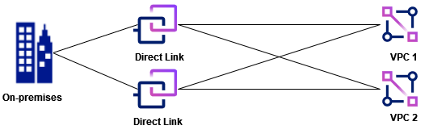
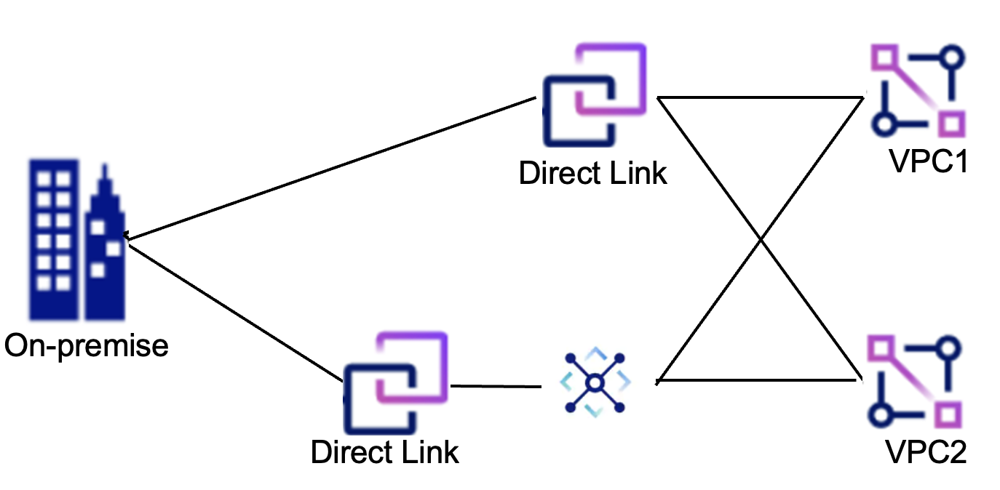

---

copyright:
  years: 2020, 2025
lastupdated: "2025-08-22"

keywords: direct link, planning

subcollection: dl

---

{{site.data.keyword.attribute-definition-list}}

# Planning for deployment
{: #dl-planning-considerations}

Provides general considerations for planning your Direct Link deployment.
{: shortdesc}

## Planning for virtual connections
{: #dl-planning-virtual-connections}

Direct Link gateways allow on-premises networks to connect to networks in the IBM Cloud using virtual connections. Network traffic between virtual connections on a Direct Link gateway is not supported. However, depending on what network prefixes are advertised from the on-prem network, traffic might still flow between the virtual connections. For example, if the on-prem network advertises the default route (`0.0.0.0/0`). In this case, all traffic originating from a network that is connected through a virtual connection that does not find a route more specific than `0.0.0.0/0` is sent to the Direct Link gateway. After traffic arrives at the gateway, the traffic is forwarded by using standard routing algorithms. If another virtual connection has a route that matches the destination address of the traffic, then it is forwarded to the network on that virtual connection (instead of the less specific `0.0.0.0/0` of the on-premises network).

## Planning for the Direct Link Dedicated MACsec feature
{: #macsec-feature-dedicated}

You can enable MACsec (IEEE 802.1AE) when ordering IBM Cloud Direct Link Dedicated to secure Ethernet connections between your on-premises network and IBM Cloud. MACsec operates at the data link layer (Layer 2) of the OSI model, encrypting all Ethernet traffic, including control plane protocols like ARP and DHCP, to protect against eavesdropping, tampering, and local network attacks.

MACsec provides several key security features:

* Origin authentication using a Connectivity Association Key (CAK)
* Replay protection with a configurable window for out-of-order frames
* Data confidentiality through AES encryption
* Data integrity using an Integrity Check Value (ICV) per frame

MACsec sessions are established between your MACsec-capable device and the IBM cross-connect switch. The feature supports a primary CAK and an optional fallback CAK in case of a mismatch. CAK secrets are securely stored as IBM Hyper Protect Crypto Services (HPCS) key resources. To enable this integration, Direct Link must be authorized to retrieve the relevant keys from your HPCS instance.

MACsec uses industry-standard MACsec Key Agreement (MKA) for secure key management. It employs hardware-based AES encryption, providing strong security with minimal impact on performance. The encryption ensures data confidentiality and integrity, operating at Layer 2 without the need for changes to higher-layer protocols or applications. IBM also provides guidance for securely rotating CAKs to ensure uninterrupted encryption without impacting traffic.

MACsec is available in select locations where IBM Cloud supports MACsec-capable cross-connect infrastructure. Currently, MACsec for Direct Link Dedicated is available in Dallas, Washington DC, Toronto, and Montreal. 
{: attention}

IBM has tested and verified the implementation of Cisco MACsec IEEE 802.1AE for encryption and security at Layer 2. While IBM’s testing has been conducted specifically on Cisco’s MACsec solution, IBM supports other MACsec solutions that implement the IEEE 802.1AE standard. If you encounter any issues or require assistance with a MACsec solution, IBM Support is available to assist. 

### Related links
{: #macsec-related-links}

* [MACsec prerequisites](/docs/dl?topic=dl-macsec-prerequisites)
* [MACsec guidelines and restrictions](/docs/dl?topic=dl-limitations-macsec)
* [Ordering IBM Cloud Direct Link Dedicated](/docs/dl?topic=dl-how-to-order-ibm-cloud-dl-dedicated)
* [Rotating CAKs](/docs/dl?topic=dl-macsec-cak-rotation)
* [Viewing the details of a direct link](/docs/dl?topic=dl-viewing-details)

## Using AS prepends with VPC connections
{: #as-prepends-routes}

Currently, VPC networking doesn't consider the AS path length when selecting the best route for network traffic. However, you can use a transit gateway between the direct link and VPC in certain topologies to achieve the same outcome. Also, if prefix values are repeated across different AS prepends (of the same policy), the first instance of the prefix value sets the prefix length; the rest are ignored.

Keep in mind that AS prepends currently have no effect on the routing between VPCs and direct links.
{: important}

### Examples
{: #as-prepend-examples}

The following deployment topologies illustrate various AS Prepend scenarios when connecting to VPCs.

1. VPC chooses a route regardless of the AS path length.

   {: caption="AS prepends have no effect on the routing between VPCs and direct links." caption-side="bottom"}

1. VPC routes to the transit gateway, then the transit gateway considers the AS path length when choosing the route to on-premises.

   {: caption="AS prepends are considered during route determination." caption-side="bottom"}

1. The local transit gateway is preferred over the global transit gateway.

   {: caption="AS prepends will not be considered during route determination." caption-side="bottom"}

1. The local transit gateway is preferred over the global transit gateway. However, the AS path is considered to get to the on-premises.

   {: caption="AS prepends are considered during route determination." caption-side="bottom"}

1. A direct link to VPC connection is always a higher priority than a direct link (attached to a transit gateway) connected to a VPC.

   {: caption="Direct link directly attached to a VPC is always higher priority than a direct link (attached to a transit gateway) connected to a VPC." caption-side="bottom"}

### Related links
{: #as-prepends-related-links}

* [Using AS prepends to manage route priorities](/docs/dl?topic=dl-dl-about#use-case-1)
* [Influencing route preference using AS prepends](/docs/dl?topic=dl-models-for-diversity-and-redundancy-in-direct-link#dl-bgp-path-selection)
