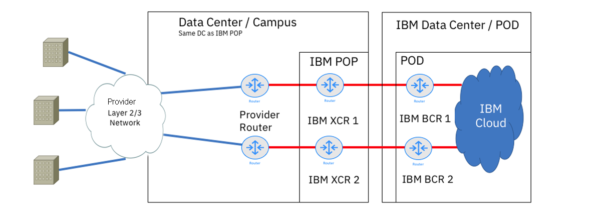
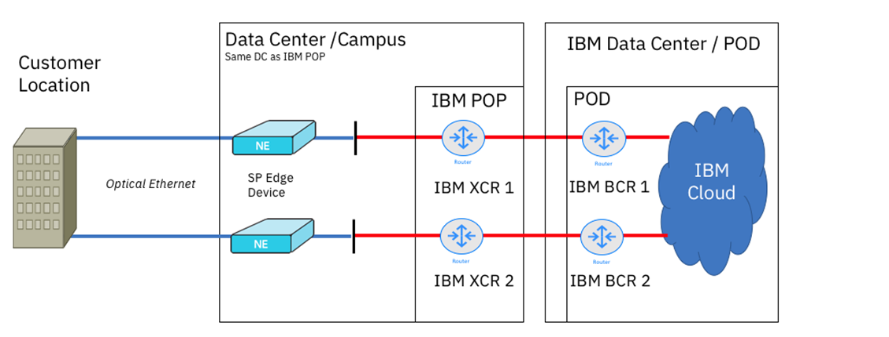
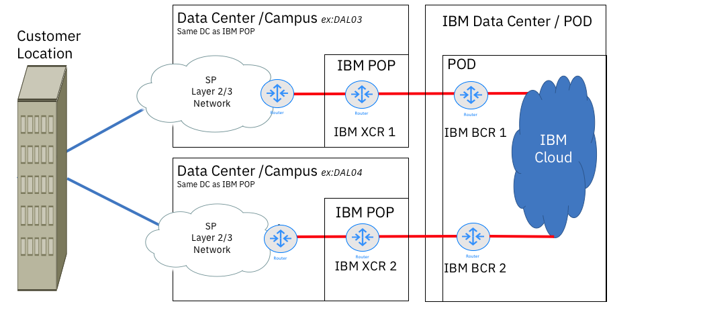
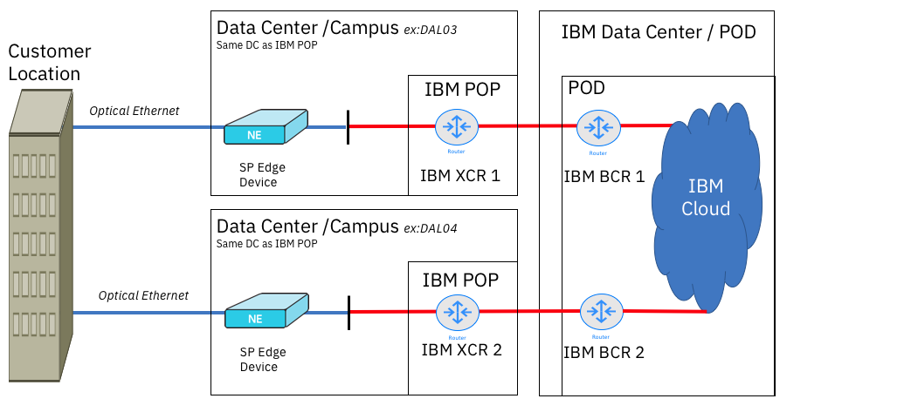
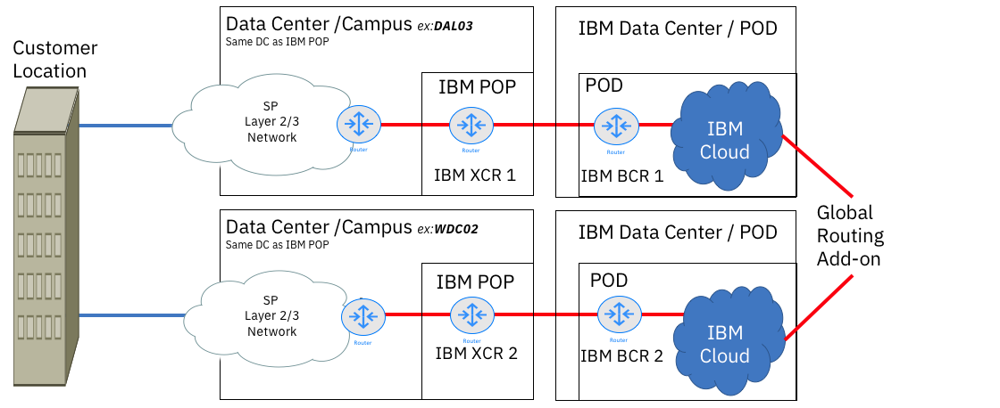
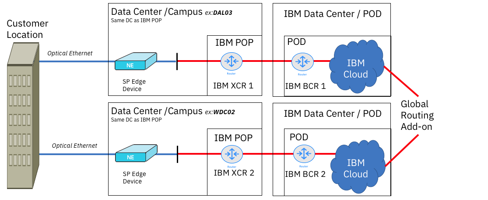
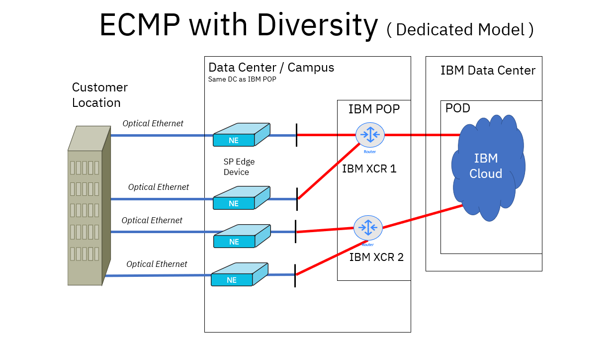

---

copyright:
  years: 2018, 2025
lastupdated: "2025-04-21"

keywords: direct link

subcollection: dl

---

{{site.data.keyword.attribute-definition-list}}

# Models for diversity in {{site.data.keyword.dl_short}}
{: #models-for-diversity-and-redundancy-in-direct-link}

This document presents common redundant {{site.data.keyword.dl_short}} configurations, which can help you find the model that most closely matches your needs to create the most successful {{site.data.keyword.dl_full}} deployment.
{: shortdesc}

Since customers have the responsibility for creating diversity through their border gateway protocol (BGP) schemas to generate a fully redundant configuration, the customer must provision the number of direct links as per the wanted SLA and diversity they require. The provisioned direct links must be configured with separate, cross-connect routers (XCR) to avoid single points of failure.

The configurations are arranged in increasing levels of complexity and also according to the {{site.data.keyword.dl_short}} offering.
{: shortdesc}

Key:

* BCR - Back-end customer router
* XCR - Cross-connect router
* NE - Network Edge

## Influencing route preference by using AS prepends
{: #dl-bgp-path-selection}

If the same route prefixes are being advertised to and from IBM Cloud through the BGP session for Direct Link, BGP determines the best path. If the local preference of both paths is equal, such as in the case for Direct Link, the BGP path follows the shortest AS path. Using AS prepends, you can control which path is longest, reducing the priority. The local Autonomous System Number (ASN) on the BGP session is prepended three or more times to the matched route's AS-PATH, artificially increasing that path's length.
{: shortdesc}

The greater the repetition value, the greater the preference is affected. Using three or more AS prepends to your prefixes ensures a significant difference.
{: important}

You can configure AS prepends when you [order Direct Link Connect](/docs/dl?topic=dl-how-to-order-ibm-cloud-dl-connect), [order Direct Link Dedicated](/docs/dl?topic=dl-how-to-order-ibm-cloud-dl-dedicated), or [after your direct link is provisioned](/docs/dl?topic=dl-prepend-as-paths). A prepend rule is set up with a policy to determine whether the rule targets _exported routes_ (virtual connection routes that are advertised to an on-premises network) or _imported routes_ (on-premises routes that are advertised to the IBM Cloud infrastructure). A prepend rule also has a repetition value, which determines how many times the local BGP session ASN is applied to routes. 

The longer the repetition, the less priority the routes have. Optionally, rules have one or more prefixes that are used to match routes. If provided, only routes matching the prefixes are prepended. Without a prefix, all routes are affected by the prepend rule.

Currently, IBM Cloud Direct Link supports influencing route preference only with AS prepends. Direct Link does not support influencing the route preference with the following BGP route attributes:

* Weight
* Local preference
* Multiple Exit Discriminator (MED)

For more information, see [Using AS prepends to manage route priorities](/docs/dl?topic=dl-dl-about#use-case-1) and [Using AS prepends with VPN connections](/docs/dl?topic=dl-dl-planning-considerations&interface=ui#as-prepends-routes).

Similar rules apply on the route prefixes that IBM Cloud advertises. The IBM Cloud routers advertise all prefixes that are associated with all applicable Direct Link connections equally (through BGP) with no additional BGP attributes to indicate path preference. You can implement import policies of your choice to prevent asymmetric routing scenarios that align with any existing export policies.
{: note}

## Sample network topologies to achieve diversity
{: #section-1-diversity-models}

The configurations that are shown in this group assume that the assets are located in the same PoP and in the same global market.

{: caption="{{site.data.keyword.dl_short}} Connect with diversity in the same PoP (non-AZ)" caption-side="bottom"}

{: caption="{{site.data.keyword.dl_short}} Dedicated with diversity in same PoP (non-AZ)" caption-side="bottom"}

## Diversity that includes AZs and global routing options
{: #section-2-diversity-models}

The configurations that are shown in this group offer options for connecting across local availability zones and markets.

### Diversity in a local availability zone (AZ)
{: #section-2-part-a}

{: caption="{{site.data.keyword.dl_short}} Connect with diversity in a local AZ" caption-side="bottom"}

{: caption="{{site.data.keyword.dl_short}} Dedicated with diversity in a local AZ" caption-side="bottom"}

### Diversity in different local markets, with global routing
{: #section-2-part-b}

{: caption="{{site.data.keyword.dl_short}} Connect with diversity and global routing" caption-side="bottom"}

{: caption="{{site.data.keyword.dl_short}} Dedicated with diversity and global routing" caption-side="bottom"}

## Achieving redundancy
{: #how-to-achieve-diversity-and-redundancy}

If you are looking for High Availability (HA), or full redundancy, set up two links into different XCRs in the same data center (for example DAL03). Then, fail over as needed by using BGP configurations. 

ECMP routing can be utilized for ingress traffic entering IBM Cloud. However, ECMP is not supported for traffic within IBM Cloud leveraging Direct Link connectivity, nor for ECMP routes that egress from IBM Cloud to an on-premises client. If you connect your direct link to an ECMP-capable transit gateway, some amount of ECMP will be available for outbound traffic.
{: important}

{: caption="ECMP with Dual XCRs" caption-side="bottom"}
