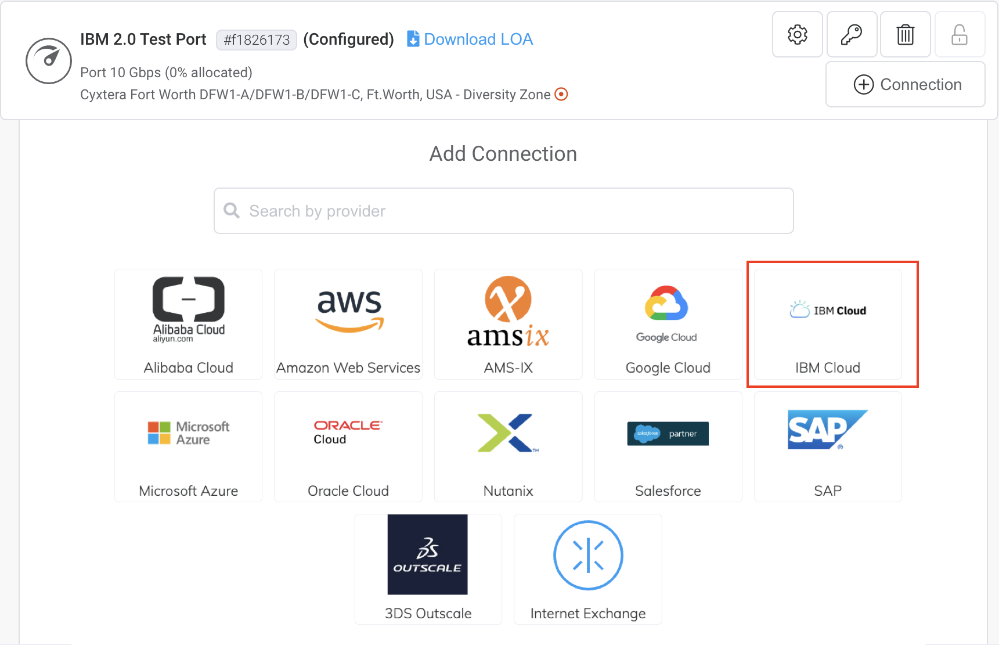
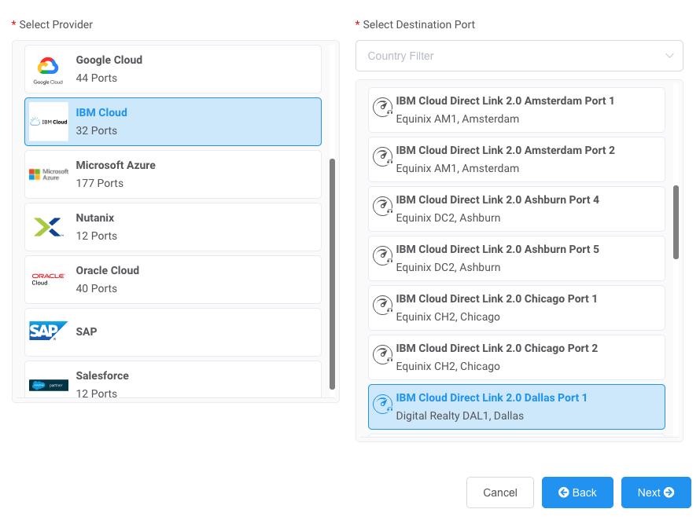
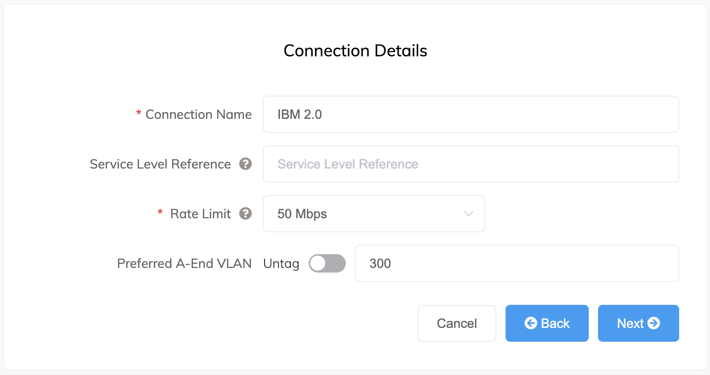
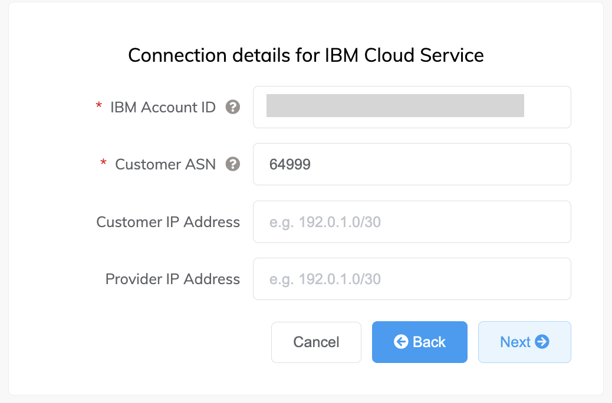
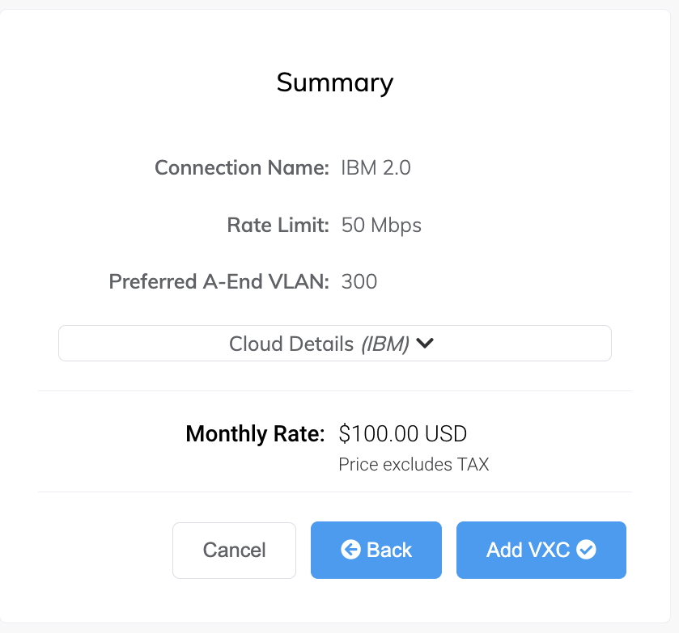

---

copyright:
  years: 2020, 2024
lastupdated: "2024-06-20"

keywords: direct link

subcollection: dl

---

{{site.data.keyword.attribute-definition-list}}

# Megaport ordering considerations
{: #megaport}

Follow these steps to order an {{site.data.keyword.dl_full}} Connect gateway with Megaport:

1. In the [Megaport Portal](https://portal.megaport.com/login){: external}, go to the Services page and select the Port you want to use.
1. Add an IBM Cloud connection for the Port.

   If this is the first connection for the Port, click the IBM Cloud tile. The tile is a shortcut to the configuration page. Alternatively, click **+Connection** > **Cloud** > **IBM Cloud**.

   {: caption="Add connection to IBM Cloud" caption-side="bottom"}

1. Select the IBM Direct Link location where the peer will be set up with IBM Cloud and click **Next**.

   This destination should match the peer location selected in the IBM Cloud.

   {: caption="Select IBM Direct Link location" caption-side="bottom"}

1. Specify these connection details:

   * **Connection Name** – The name of your VXC to be shown in the Megaport Portal.
   * **Service Level Reference** (optional) – Specify a unique identifying number for the Direct Link Connect gateway to be used for billing purposes, such as a cost center number or a unique customer ID. The service level reference number appears for each service under the Product section of the invoice. You can also edit this field for an existing service.

      Partner managed accounts can apply a Partner Deal to a service. For details, see [Associating a Deal With a Service](https://partner-docs.megaport.com/services/deal-ids/){: external}.
      {: note}

   * **Rate Limit** – This is the speed of your connection in Mbps. The speed tiers available are dependent on the selected location, and match the speeds available in IBM. Select the port speed from the drop-down list to match the selected speed in the IBM Cloud console for the Direct Link service.

   * **Preferred A-End VLAN** (optional) – Specify an unused VLAN ID for this connection.

      This must be a unique VLAN ID on this Port and can range from `2` to `4093`. If you specify a VLAN ID that is already in use, the system displays the next available VLAN number. The VLAN ID must be unique to proceed with the order. If you don’t specify a value, Megaport assigns one.

      Alternatively, you can click **Untag** to remove the VLAN tagging for this connection. The untagged option limits you to only one direct link deployed on this Port.

      {: caption="Connection Details" caption-side="bottom"}

1. Click **Next**. The Cloud Details page appears.
1. Specify these IBM Cloud details:

   * **IBM Account ID** – Your IBM account ID. You can get your account ID from the IBM account setting in the IBM Cloud console.

      This is used to link the Megaport Portal and IBM Cloud console. Confirmation for this new connection is sent to the specified account ID in the IBM Cloud console.

   * **Customer ASN** – Your network’s Autonomous System Number. This can be a public or private ASN and the supported ranges are `1` - `64495`, `131072` - `4199999999`, or `4201000000` - `4201064511` (default is `64999`).

   * **Customer IP Address** (optional) – The IP address space (in CIDR format) you will use on your network for peering. For private connections, this field is optional and if left blank, Megaport assigns a private `/30` address. For public connections, this field is required and needs public IPs (`/30`) allocated by you for BGP connectivity. You must own the public IPs.

   * **Provider IP Address** (optional) – The IP address space in CIDR format assigned in the IBM network for peering. This field is optional and if left blank, Megaport automatically assigns a private `/30` address.

   {: caption="Connection details for IBM Cloud Service" caption-side="bottom"}

1. Click **Next**. A summary page appears that includes a drop-down of the IBM cloud details and the monthly cost.

   {: caption="Summary page" caption-side="bottom"}

1. Click **Back** to make changes or click **Add VXC**.

   After you have finished this configuration, you can configure additional VXCs or proceed through the ordering process.

1. Review the details and click **Order**.

1. Click **Order Now** to complete the ordering process.

   The IBM Portal Connection prompt displays. This is a reminder that you need to approve or reject the request in the IBM Cloud console, and provides a link to the IBM Cloud console.

After the direct link is created and ordered in the Megaport Portal, the change is available immediately in the IBM Cloud console. After you verify and approve the inbound IBM Direct Link Connect gateway in the IBM Cloud console, the IBM Direct Link Connect status changes to `Provisioned` and the direct link is active.

**Notes**:

* When editing a direct link in the Megaport Portal, a prompt listing the changes appears first, then the IBM Portal Connection prompt. If editing an older VXC to IBM Cloud Direct Link, a prompt appears stating that Megaport has updated API integrations, and advises you to cancel and reorder the VXC. In this situation, we recommend that you cancel and then reorder the VXC using the latest API integration.
* When terminating a direct link in the Megaport Portal, confirm the termination in the prompt that appears. The IBM Portal Connection prompt appears to remind you to cancel the service in the IBM Cloud console also. The direct link is terminated on the Megaport side, but you must do the same in the IBM Cloud console to fully terminate the service.
