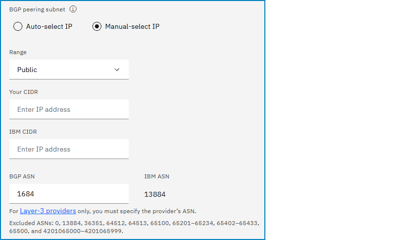
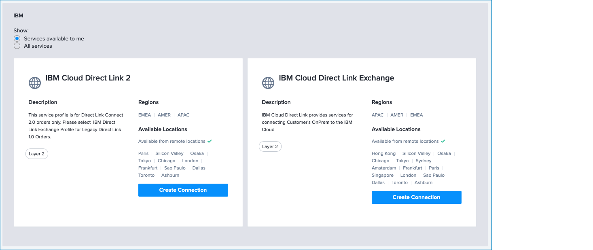
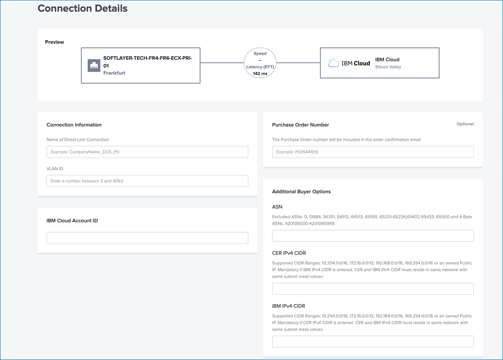

---

copyright:
  years: 2020, 2024
lastupdated: "2024-06-20"

keywords: direct link

subcollection: dl

---

{{site.data.keyword.attribute-definition-list}}

# AT&T NetBond Essentials using Equinix Fabric ordering considerations
{: #att-netbond-essentials}

Follow these steps to create a Direct Link connection for your AT&T NetBond Essentials service provider.

1. Obtain an IP subnet and local ASN (Public ATT ASN) for the BGP from the AT&T NetBond Essentials service on the Total Access Orchestration (TAO) platform.

   This block is `/29` broken down into two `/30` subnets. You require the `/30` subnet for ordering in the {{site.data.keyword.cloud}} console.
   {: note}

1. Using your IBM Cloud account, order an {{site.data.keyword.cloud_notm}} Direct Link Connect gateway through the [{{site.data.keyword.cloud_notm}} console](/login){: external}. For instructions, see [Ordering IBM Cloud Direct Link Connect](/docs/dl?topic=dl-how-to-order-ibm-cloud-dl-connect).

   During the ordering process (Step 7), Make sure to specify the AT&T-supplied IP addresses instead of your actual client Edge IP addresses.

   To add your own IP address, follow these steps:

      * Choose **Manual-select IP**.
      * For Range, select **Public**.
      * For Your CIDR, enter the specific IP address from the AT&T-supplied subnet (for example, `10.254.0.26/30`).
      * For IBM CIDR, enter the specific IP address from remaining addresses in the AT&T-supplied subnet (for example, `10.254.0.25/30`).
      * for the BGP ASN, enter the supplied local ASN (AT&T Public ASN) supplied by AT&T.

         {: caption="Manual-select IP Public Range" caption-side="bottom"}

   Write down and retain the connection name and the service key that was generated from the order.
   {: important}

1. Send the name of the connection and the generated service key to the AT&T Service Provider team. If you are granted permission by AT&T to order Direct Link Connect through the Equinix Fabric portal, complete your order using the Equinix Cloud Exchange (ECX) Fabric portal.

## AT&T TAO / NetBond Essentials notes when ordering using the Equinix Fabric portal
{: #att-tao-netbond-notes-when-ordering}

1. In the **IBM Cloud Direct Link 2** profile, click **Create Connection**.

   {: caption="Equinix ordering" caption-side="bottom"}

1. **Very Important** - On the Connection Details page, for the **IBM Cloud Account ID**, AT&T must enter the service key (for example, `aaa-bbbb-cccc`) that was generated when you provisioned your direct link. You can find this key on the Direct Link details page.

   {: caption="Connection Details" caption-side="bottom"}

## AT&T TAO / NetBond Essentials submits your Equinix order using the Equinix Fabric portal
{: #att-tao-netbond-submits-order}

After the order is completed, AT&T will need to notify you that the Equinix order was submitted.

The IBM Special Network Services (SNS) team receives the Equinix request (submitted by AT&T on your behalf) and is able approve the connection in the buyer-side portal. You can view your newly created virtual connection for Direct Link by going to **Connections**. The connection will be in a pending, provisioning state (**Pending Provider VLAN**).

The timeline for approval is within 24-48 hours. If the 48-hour Service Level Agreement (SLA) is not acceptable, you can create an [IBM Support case](/unifiedsupport/cases/form) and request that it be routed to the SNS team.
