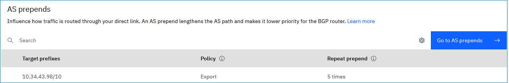
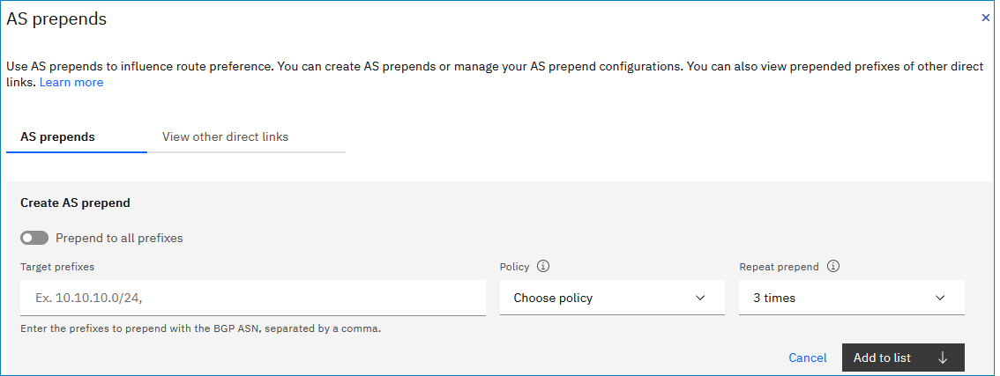

---

copyright:
  years: 2022
lastupdated: "2022-09-21"

keywords: direct link

subcollection: dl
---

{{site.data.keyword.attribute-definition-list}}

# Prepending an AS path to influence route priority
{: #prepend-as-paths} 

In the situation where the same route prefixes are being advertised to IBM Cloud through the BGP session for Direct Link, you can prepend one or more Autonomous System Numbers (ASNs) to the route advertisement. AS prepend makes the AS path longer, and therefore, the route for the prefix is less preferred by the BGP protocol on the IBM Cloud router. If the duplicate route prefixes are received with the same AS path length from different origin routers, IBM Cloud gives preference to the oldest route received. In other words, the first BGP session that advertises a given route prefix receives path preference. 
{: shortdesc}

You can create AS prepends and manage your AS prepend configurations after direct link provisioning. You can also view prepended prefixes of other direct links.

## Before you begin
{: #prepends-before-you-begin}

* You must have two competing routes of equal priority before an AS prepend will take effect. 
* Make sure to review [known limitations](/docs/dl?topic=dl-known-limitations&interface=ui).
 
## Prepending an AS path by using the UI
{: #prepend-as-path-ui}
{: ui}

To prepend an AS path by using the UI, follow these steps:

1. From your browser, open the [{{site.data.keyword.cloud_notm}} console](/login){: external} and log in to your account.
1. Select the Menu icon  from the upper left, then click **Interconnectivity > Direct Link**.
1. In the Direct Link table, click the Direct Link name of the gateway where you want to manage route priority.
1. On the Details page, click the **BGP** tab and scroll to the AS prepends section. Then, click **Go to AS prepends**.

   Alternatively, you can use the **AS prepends** shortcut on the Overview tab.
   {: tip}

   {: caption="AS prepends" caption-side="bottom"}       
1. From the AS prepends page, click **Create** to create an AS prepend, or use the Actions  menu to **Edit** or **Delete** an existing AS prepend.

   1. Select **Prepend to all prefixes** if you want the specified prepend added to all prefixes.
   1. Enter the target prefixes to prepend with the BGP ASN. When you specify a comma after the prefix, a tag shows in the field.       
   1. Choose a policy:
   
      * Import - Use to apply to routes _from_ an on-prem network.
      * Export - Use to apply to routes _to_ an on-prem network.
   1. Specify how many times that you want to repeat the AS number added to the beginning of the path.  
   1. Click **Add to list**.

   {: caption="Creating an AS prepend" caption-side="bottom"}

1. When you are done adding AS prepends, click **Save**.

## Related links
{: #prepending-related-links} 

* [Planning considerations when using AS prepends with VPC connections](/docs/dl?topic=dl-as-prepends-routes&interface=ui)
* [Influencing route preference using AS prepends](/docs/dl?topic=dl-models-for-diversity-and-redundancy-in-direct-link&interface=ui#dl-bgp-path-selection) 
* [Using AS prepends to manage route priorities](/docs/dl?topic=dl-dl-about&interface=ui#use-case-1)
