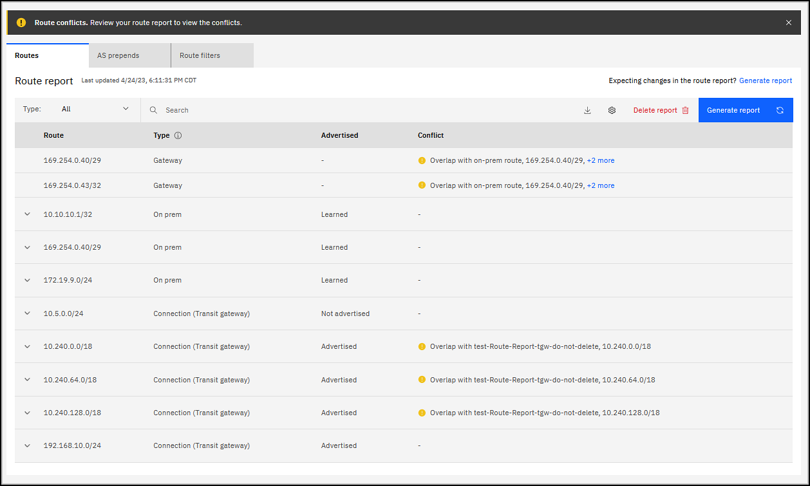

---

copyright:
  years: 2023, 2024
lastupdated: "2024-12-18"

keywords: direct link

subcollection: dl
---

{{site.data.keyword.attribute-definition-list}}

# Generating a direct link route report
{: #generate-route-reports}

You can generate a report of all routes known to a direct link and its connections. This report allows you to verify the expected routes, view what virtual connections are contributing which routes to your direct link, and see next-hop address details of the routes received. If using the cross-account VPC linking feature, you can also see which prefixes or subnets are being routed through your cross-connect router.

You can retrieve a route report by using the UI, CLI, or API.

## Route report considerations
{: #route-report-considerations}

Review the following considerations when working with a route report:

* After a new virtual connection (VPC, classic, or transit gateway) reaches `Active` state, allow 5 minutes for the routes to be learned by your direct link. Generating a route report before all routes are learned results in a partial route report.
* On-prem routes won't show up until approx 5 mins after BGP is set to `Established` status. Gateway routes won't show up until the gateway is finished provisioning.
* If a connection exposes a route of `0.0.0.0/0`, that route is ignored when computing overlapping prefixes.
* Only one report per gateway is available at any time. If you generate a new report, the old report is deleted.
* Older route reports might be inaccurate after you add or remove a connection. As a result, if you update routes within those connections, it is recommended that you generate a new route report.

## Generating a route report by using the UI
{: #generate-route-report-ui}
{: ui}

To generate a route report by using the UI, follow these steps:

1. From your browser, open the [{{site.data.keyword.cloud_notm}} console](/login){: external} and log in to your account.
1. Select the Menu icon  from the upper left, then click **Infrastructure** > **Network** > **Direct Link**.
1. In the Direct Link table, click the Direct Link name that you want to generate the report for.
1. On the Details page, click the **BGP** tab and scroll down to the **Routes** tabbed view. Then, click the **Generate report** link.

   Alternatively, you can use the **Route report** shortcut on the Overview tab.
   {: tip}

   The route report begins building, and might take a few minutes to generate depending on the complexity of the direct link. Keep in mind that you cannot generate another report until the report is finished processing, or unless you click **Cancel report**.

After the report generates, the following columns are displayed in the route report table.

* Route - Specifies the route address (for example, `169.254.0.40/29`).
* Type - Specifies the route type:
   * Connection - Specifies the name (or ID) of the specific connection that the route originated from.
   * Gateway - Set up on the IBM router to establish BGP.
   * On prem - Originates from your on-premises data center.

   You can expand the On-prem row to view the AS path, next hop, and any conflicts. For Connection types, expand the row to show the AS path, local pref, source, and any conflicts.
   {: note}

* Advertised - Specifies whether the route is advertised, learned, or not advertised.

   The route is advertised only when BGP is established.
   {: note}

* Conflict - Specifies whether or not there is a route conflict.

Select the Settings icon  to change the table's row height or edit column settings.
{: tip}

### Route conflicts
{: #route-conflicts}

Conflicting routes show in the **Conflict** column of the **Routes** view. Overlapping routes are a common issue when configuring a direct link. If the routes from two or more connections overlap, traffic might not be routed properly. For example:

   {: caption="Display route report" caption-side="bottom"}

If there are multiple conflicts, click the link to open a side panel with more information. After you resolve the conflicts, generate a new report.
{: note}

## Generating and viewing a route report by using the CLI
{: #generate-route-report-cli}
{: cli}

To generate and view a route report by using the CLI, run the following command:

```sh
ibmcloud dl route-report-create|rrc GATEWAY_ID [--output format] [--help|-h]
```

Where:

* **GATEWAY_ID** is the ID of the gateway.
* **--output json** formats the output in JSON.
* **--help | -h** gets help on this command.

For example, to create a route report for a direct link:

```sh
ibmcloud dl route-report-create a771366f-2c8c-49f6-a23b-9d49fad035a3
```
{: codeblock}

For more information, see [ibmcloud dl route-report](/docs/dl?topic=dl-dl-cli&interface=cli#route-report-view) commands.

## Generating and viewing a route report by using the API
{: #generate-route-report-api}
{: api}

To generate and view a route report using the API, follow these steps:

1. Set up your [API environment](/docs/dl?topic=dl-set-up-environment) with the right variables.
1. Store any additional variables to be used in the API commands, for example:

   ```sh
   direct_link_id="11111111-b540-4766-a196-14368f328eb2"
   ```

1. Request report creation:

   ```sh
   curl -X POST "$directlink_api_endpoint/v1/gateways/$direct_link_id/route_reports?version=$api_version" -H "Authorization: $iam_token"
   ```

   For the rest of the calls, you'll need to know the ID of the newly created report. Save the ID in a variable, for example:

   ```sh
   route_report="22222222-c540-4766-a196-14368f328eb2"
   ```

   To verify that the variable was saved, run `echo $route_report` and make sure the response is not empty.

1. Wait for the report to become active, then you can view its details:

   ```sh
   curl -X GET "$directlink_api_endpointv1/gateways/$direct_link_id/route_reports/$route_report?version=$api_version" -H "Authorization: $iam_token"
   ```

   For more information, see [Gateway Route Reports](/apidocs/direct_link#list-gateway-route-reports) API.
