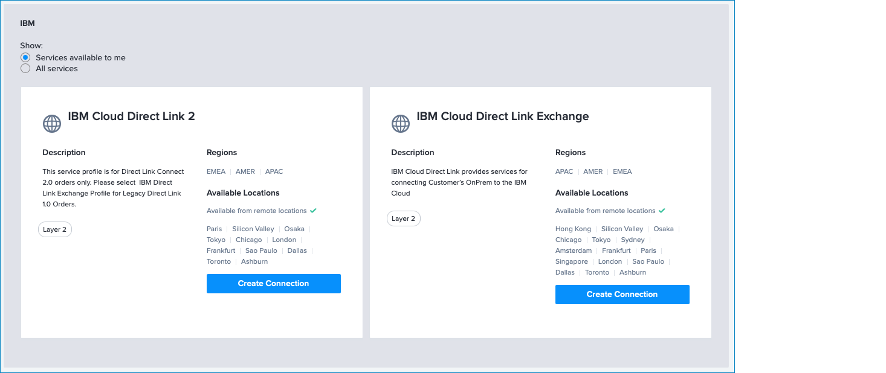
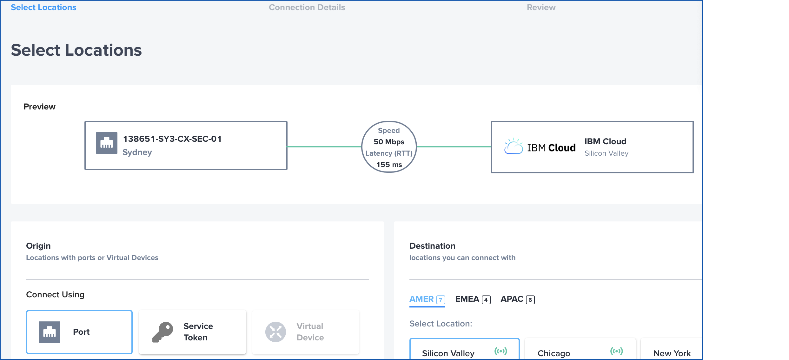
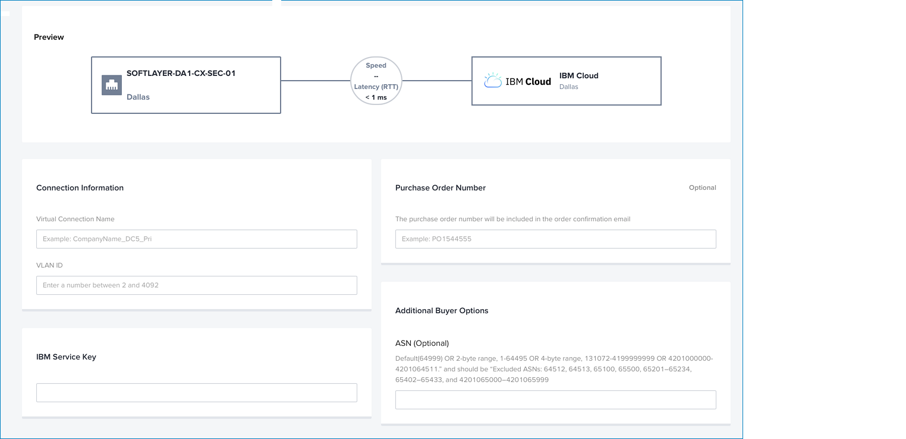
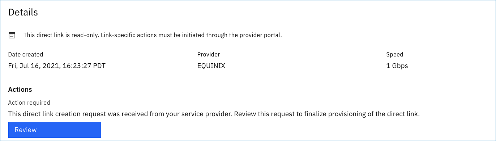
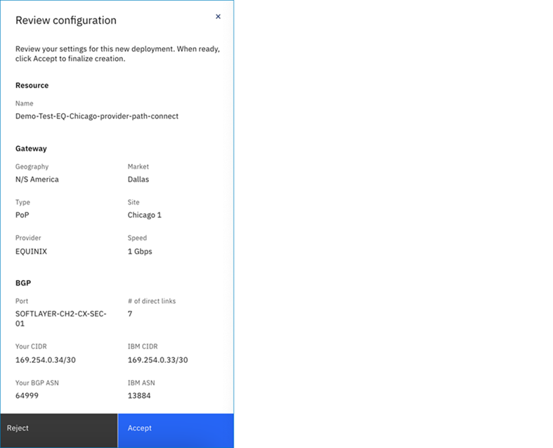
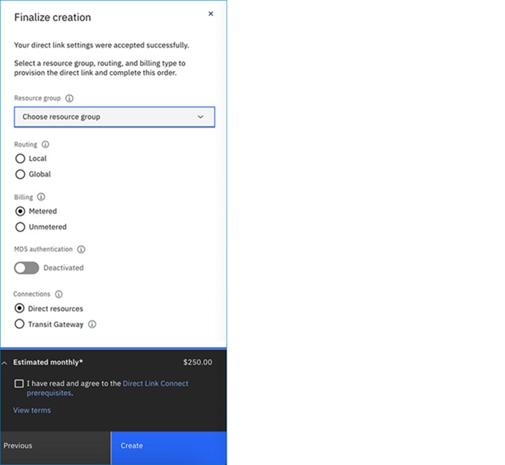
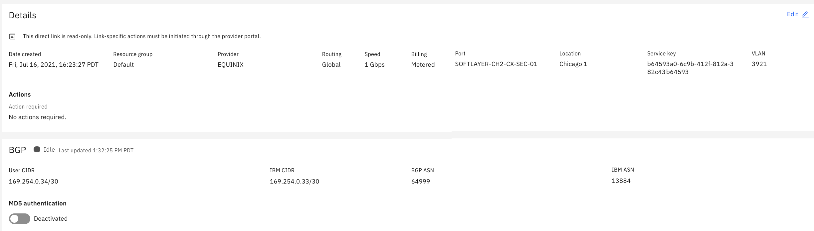

---

copyright:
  years: 2020, 2024
lastupdated: "2024-06-20"

keywords: direct link

subcollection: dl

---

{{site.data.keyword.attribute-definition-list}}

# Verizon SCI using Equinix Fabric ordering considerations
{: #verizon-sci-equinix}

Follow these steps to create a Direct Link connection with Verizon SCI and Equinix Fabric.

1. Obtain an IP subnet and local ASN (typically, the Verizon Public ASN `1684`) for the BGP from the Verizon SCI service.

   This block is usually a `/31` or `/30` IP block.
   {: note}

1. Order an {{site.data.keyword.cloud}} Direct Link Connect gateway through the [{{site.data.keyword.cloud_notm}} console](/login){: external}. For instructions, see [Ordering IBM Cloud Direct Link Connect](/docs/dl?topic=dl-how-to-order-ibm-cloud-dl-connect).

   During the ordering process (Step 7), you can specify your own IP address. Make sure to specify the Verizon SCI-supplied IP addresses instead of your actual client Edge IP addresses.

   To specify your own IP address, follow these steps:

      * Choose **Manual-select IP**.
      * For Range, select **Public**.
      * For Your CIDR, enter the specific IP address from the Verizon-supplied subnet (for example, `10.254.0.26/30`).
      * For your IBM CIDR, enter the specific IP address from the remaining addresses in the Verizon-supplied subnet (for example, `10.254.0.25/30`).
      * For BGP ASN, enter the supplied local ASN (typically, the Verizon Public ASN `1684`) supplied by Verizon.

      {: caption="Manual-select IP Public Range" caption-side="bottom"}

   Write down and retain the connection name and the service key generated from the order.
   {: important}

1. Send the connection name that you created and the generated service key to the Verizon SCI team. If you are granted permission by Verizon to order Direct Link Connect through the Equinix Fabric portal, complete your order using the Equinix Cloud Exchange (ECX) Fabric portal.

## Completing your order using the Equinix Cloud Exchange Fabric portal
{: #verizon-equinix}

You must use the Equinix Cloud Exchange (ECX) Fabric portal to create a connection for your Equinix service provider. Then, using your IBM Cloud account, return to the Direct Link page in the [IBM Cloud console](/interconnectivity/direct-link){: external} to review, accept, and finalize the creation of your direct link.

For Exchange on Classic instructions, see [Steps to order Direct Link Exchange on Classic for Equinix](/docs/direct-link?topic=direct-link-how-to-order-ibm-cloud-direct-link-exchange#provisioning-ibm-cloud-direct-link-exchange-for-equinix).
{: note}

1. [Sign in](http://ecxfabric.equinix.com){: external} to the Equinix Fabric Portal.
   * Enter your username and password.
   * Click **Sign In**.
1. In the Frequent Connections section, click the **IBM Cloud** tile.
1. In the **IBM Cloud Direct Link 2** profile, click **Create Connection**.

   {: caption="Equinix ordering" caption-side="bottom"}
1. In the Origin section, click **Port**.

   {: caption="Select a Port, Location, and Destination" caption-side="bottom"}

1. Select a **Location**, followed by a **Destination**. Then, click **Next**.
1. On the Connection Details page, enter the connection information.

   {: caption="Connection Details" caption-side="bottom"}

1. Select a **Connection Speed**, then click **Next**.
1. Review and click **Submit Your Order**.
1. Return to the [Direct Link page](/interconnectivity/direct-link){: external} in the IBM Cloud console using your IBM Cloud account. Notice that the connection status for your direct link connection states **Create Approval Pending**.
1. Click the Direct Link name in the table to view its Details page. Then, go to the **Actions** section and click **Review** to finalize provisioning of the direct link.

   {: caption="Select to Review this request to finalize direct link provisioning" caption-side="bottom"}

1. In the Review configuration side panel, review your settings, then click **Accept**.

   {: caption="Select Accept to finalize creation of your direct link" caption-side="bottom"}

1. After your direct link settings are accepted successfully, select a resource group, routing option, and billing type. Optionally, you can [enable MD5 authentication](/docs/dl?topic=dl-enable-disable-md5) to provide additional security for the BGP session, or [update your network connection type](/docs/dl?topic=dl-virtual-connection-types).

   Review your order summary, agree to the [Direct Link Connect prerequisites](/docs/dl?topic=dl-ibm-cloud-dl-prerequisites), and then click **Create** to complete this order.

   {: caption="Complete your direct link settings, then click Create" caption-side="bottom"}

Your direct link is created:

{: caption="Completion of your direct link" caption-side="bottom"}
